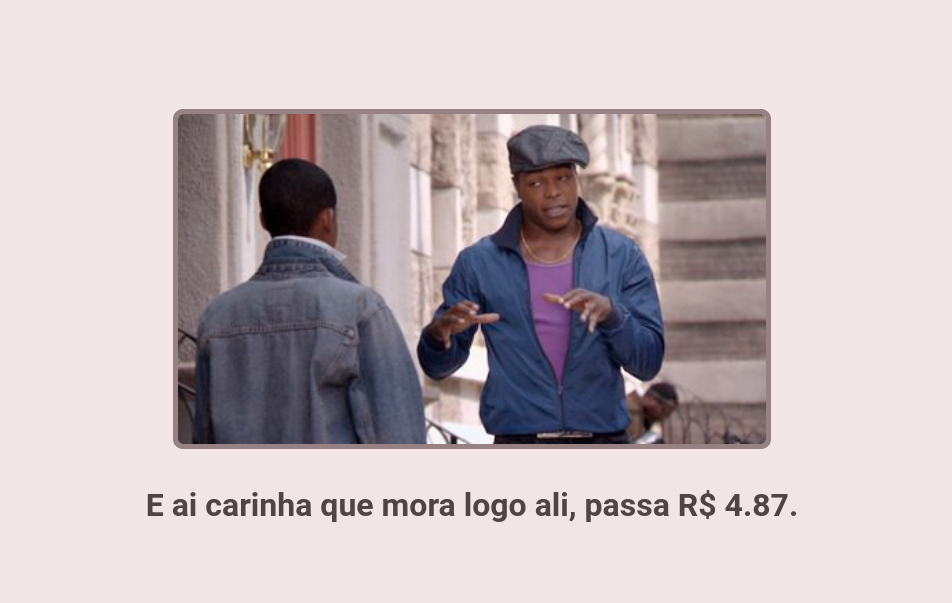

## 💵 Passa 1 dólar

## 💭 O que é este projeto?

Este projeto é uma página web que faz referência a série _Todo Mundo Odeia o Chris_ com o intuito de exibir a cotação atual do dólar.

O projeto conta com um script para pegar a cotação do dólar através da API **frankfurter** que pode ser acessada [clicando aqui](https://www.frankfurter.app/).

## 🖥️ Como rodar este projeto?

Para iniciar a aplicação localmente, é preciso baixar este repositório (seja pelas opções de clone do Github ou através de um arquivo .zip) e abrir o arquivo index.html através de dois cliques ou do uso de algum servidor como a extensão _Live Server_ para o Visual Studio Code.

## Links importantes

-   [Deploy da aplicação](https://passa1dolar.lelepg.app/)
-   [Documentação API](https://www.frankfurter.app/docs/)
